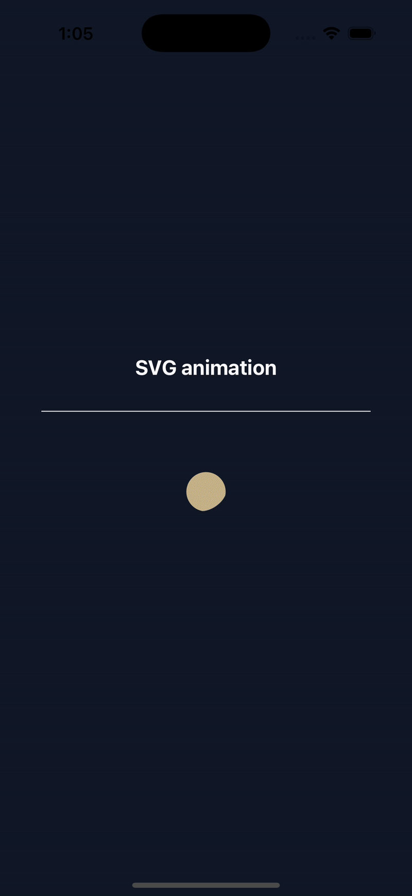

# 🌞 Toggle Animation with Reanimated & react-native-SVG

A React Native project that animates a transition between dark mode and light mode using **Reanimated** and **react-native-svg**. The animation smoothly morphs the SVG paths while applying rotation and color transitions. Works on both **iOS** and **Android**.

Inspired by [The Power of SVG Animations](<https://www.youtube.com/watch?v=0Ihn7vylPlA>) that demonstrates a similar animation in **Next.js** and **Framer Motion**





---

## 🚀 Features
- Smooth interpolation between **sun** and **moon** shapes.
- Rotation animation that works across **iOS** and **Android**.
- **react-native-svg** for rendering scalable vector graphics.
- **Expo Snack** support (for quick testing without cloning).

---

## 📦 Installation
This project uses **pnpm** as the package manager. Install dependencies with:

```sh
pnpm install
```
If you don't have pnpm, install it globally first:
```sh
npm install -g pnpm
```

## ▶️ Running the Project
Run the app in development mode with:
```sh
pnpm start
```
Then, follow the Expo CLI instructions to open it on a simulator or a physical device.

For iOS, run:
```sh
pnpm run ios
```

For Android, run:
```sh
pnpm run android
```

## 🎯 Notes
Ensure you're using pnpm to avoid dependency issues.

If running into SVG-related issues, ensure your Expo SDK version supports the latest react-native-svg.

The rotation animation is fixed to work on both iOS and Android.